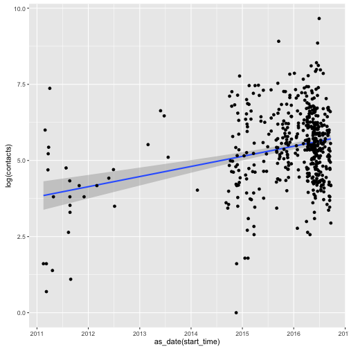
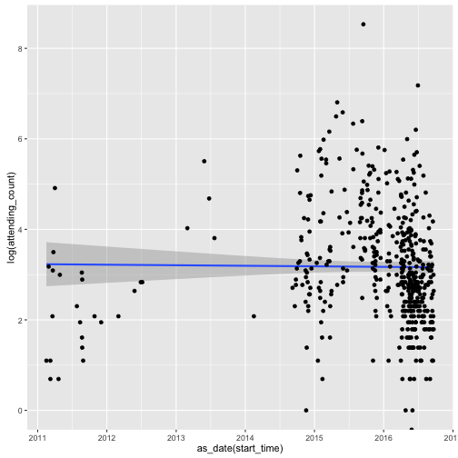
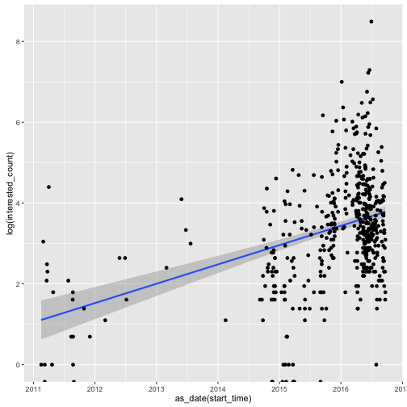
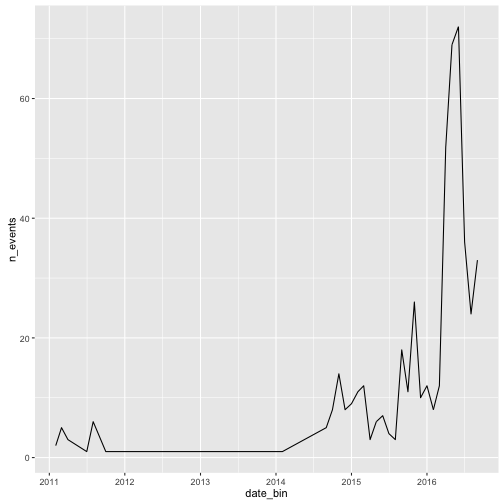
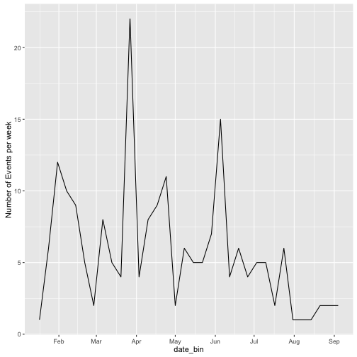

Making sense of engagement on Facebook
========================================================
author: Travis Riddle
date: 9/21/16
autosize: true

How should MakeSense measure engagement?
========================================================
1. Size of events (i.e. number of people invited)?
2. Number of people attending?
3. Number of people who are interested?
4. Number of events?

Using data scraped from the Facebook group page https://www.facebook.com/MakeSenseorg/, I show how engagement as measured by these phenomena has changed over time 

Size of event (how many people invited?)
========================================================

*More people are being invited*

Number of people attending?
========================================================

*The number of people attending is not changing*

Number of people who express interest?
========================================================

*the number of people who are interested is increasing*

Brief interpretation
========================================================
- The number of people invited is increasing, but participation (attending) is remaining flat.
  - i.e. lower success rate of invitations
- People who are interested increases at roughly the same rate as invitations

*but does any of this accurately measure engagement?*

 - I think not

Our assumption (i think) of the way engagement can grow
========================================================
1. Make a change to the website/there is some external perturbation to the MakeSense community:
2. users become more interested
3. More interested users are then more likely to attend an event.

How would this process be reflected in the data?

increased engagement = ?
========================================================
two options:

1. more users per event (what I've just shown)
  - success = next year, every event has 1M users
2. more events
  - success = next year, there are 10x the number of events of this year.
  
(I think the second option is the more realistic version)

number of events over time
========================================================

*number of events is increasing, though with a large spike in May and June of this year*

What about the makesense website?
========================================================

- Currently have 16070 registered users.
- 15352 users have signed in at least once
- only 4109 users have signed in more than once
- only 707 users have signed in more than five times
- 255 more than 10 times

Events per week
========================================================

*hard to draw any conclusions from this pattern - people just aren't using the site very much*

Conclusion
========================================================
1. Any change to the website can't have an effect unless people see it.
2. If people don't sign in to the website, they wont see the changes.

### Goals:
- drive traffic to the website 
- get people to *log in*

KPI?
========================================================
- Deriving a KPI for facebook doesn't seem terribly useful - the activity there is self-sustaining.
- At this stage, the goals for the website are simply for people to go there!

### KPI for website:
1. Number of registered users (good)
2. Number of logins (better)

KPI?
========================================================
 - Tracking the number of logins is a way of measuring how much interaction people have with your site.
 - more logins = more detailed interaction
 - number of registered users is not as useful. If someone registers and never comes back, measuring the total number of users wont tell you that.
